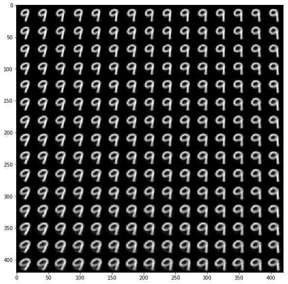
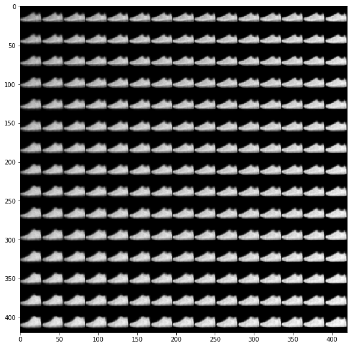
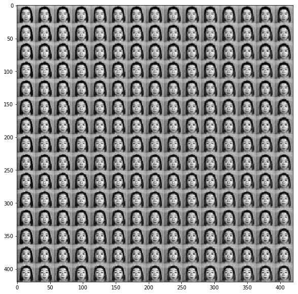

Conditional Variational Autoencoders in Keras
===
## 概要
Conditional variational autoencodersとは，VAEにラベルによる学習機能を付け足したものです．詳しい説明は，[ここ](http://cympfh.cc/paper/VAE.html)を参照するとわかりやすいと思います．

## ソースコードについて
これまでの畳みこみ版VAEやVAEのソースコードをもとに作りました．詳細はそちらをご覧ください．  
* Cond_VAEクラス引数の説明  
`x_train.shape`: データのサイズ指定  
`y_train.shape`: ラベルのサイズ指定  
`latent_dim`: 潜在空間の次元  
`intermediate_dim_en`: 中間層の次元（エンコーダ）  
`intermediate_dim_de`: 中間層の次元（デコーダ）  
`epsilon_std`: reparametization trickを使うときに必要  
`batch_size`: バッチサイズ指定

## 実行結果
1. データセットをMNISTにして50[epochs]回した結果
  

2. データセットをFashion MNISTにして50[epochs]回した結果
 

3. データセットをJAFFEにして50[epochs]回した結果  
[utility-load-dataset](https://github.com/gucci-j/utility-load-dataset)を使用して，外部からデータセットを読み込んで実行してみました．
 